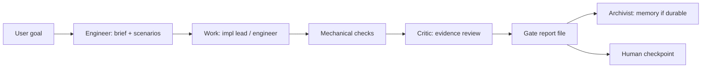

# Factory orchestration — one goal, multiple agents

Use when a user gives a **goal** (single or multi-step) and expects the **Omakase team** to run Level 4 — not a single chat reply.

**User says:** “Add gate report CI and make sure our factory checkpoints are real.”  
**User does not:** name leads, seeds, scenarios, or handoffs.

---

## Who owns what

| Role | Lead | Responsibility |
|------|------|----------------|
| Orchestrator | **@omakase-engineer** | Task brief, scenarios, delegation, mechanical checks, **final gate file**, human checkpoint |
| Build | `omakase-implementation-lead` (delegated) | Focused implementation charter |
| Review | **@omakase-critic** | Evidence + rubric on Class 2+ before human checkpoint |
| Memory | **@omakase-archivist** | Durable decisions / taste when factory policy changes |
| Specialists | senior-reviewer, verify path via critic | As Engineer routes |

**Engineer is the factory floor manager.** Other leads are invoked at defined points — not optional on Class 2+ factory work.

---

## Phases (one goal)

### Phase 1 — Intake (Engineer)

1. Read `factory.md`, `taste.md`, `decisions.md`, `reference/task-intake.md`.  
2. Publish **Task brief** (plain language).  
3. Class **2+:** draft scenarios → one user confirm.  
4. Save brief to `.omakaseagent/handoffs/<date>-<slug>-brief.md` on multi-step or Class 2+ work.

### Phase 2 — Work (Engineer + specialists)

- Delegate implementation when isolated context helps (`omakase-implementation-lead`).  
- Handoff charter: brief excerpt + files in scope + mechanical commands to run.  
- **Backlog item:** charter = full `.omakaseagent/backlog/NNN-*.md`; executor runs drift check and STOP rules from the plan (`reference/execution-plan.md`).  
- Save handoff: `.omakaseagent/handoffs/<date>-<slug>-to-implementation.md` (optional when backlog plan is the charter).

### Phase 3 — Mechanical evidence (Engineer)

Run every command in `factory.md` mechanical list relevant to the change. Capture exit codes in gate draft.

### Phase 4 — Critic gate (mandatory Class 2+)

Invoke **@omakase-critic** with:

- Task brief  
- Diff summary or paths  
- Mechanical output  
- Ask: rubric pass? P0/P1 issues?

Save critic summary into gate `## Critic` section. Handoff file optional: `handoffs/<date>-<slug>-to-critic.md`.

**Do not** tell the user “done” before critic pass on Class 2+.

### Phase 5 — Gate artifact (Engineer)

Write `.omakaseagent/gates/<date>-<slug>-gate.md` — all headings in `reference/learn.md`.  
If repo has `npm run verify:gate-reports`, run it.

### Phase 6 — Memory (Archivist, when warranted)

If the task changes factory policy (new CI rule, new required heading, new risk class):

- **@omakase-archivist** proposes `decisions.md` diff — user confirms.  
- Skip for one-off features with no durable policy.

### Phase 7 — Human checkpoint

Tell the user: gate path, what was proven, what decision remains. Not a full diff walkthrough unless they ask.

---

## Multi-step goals

User: “Fix CI, then add gate verifier, then document the factory run.”

Engineer:

1. One **program brief** with ordered steps.  
2. **Per step:** mini brief → work → mechanical → critic (if Class 2+) → sub-gate or section in one gate.  
3. **One final gate** references all steps — preferred for related work.

Do not spawn separate user threads per step unless harness requires it.

---

## Routing failures to avoid

| Failure | Fix |
|---------|-----|
| Engineer implements + says “done” with no critic | Phase 4 mandatory on Class 2+ |
| User told to “create a seed” | `task-intake.md` — Engineer co-writes brief |
| No `factory.md` | Offer `omakase learn` once; continue Class 0–1 |
| Router/chef mode on engineering goal | Redirect to `@omakase-engineer` |
| Chat-only evidence | Gate file + mechanical output |

---

## Backlog-driven work

User: "Implement backlog/002" or Engineer proposes next item after audit.

1. Read execution plan; drift check first.  
2. Phases 1–7 unchanged — plan does not waive critic or gate.  
3. Gate `## Seed` links backlog path; `## Mechanical evidence` includes plan done-criteria commands.  
4. Update `backlog/README.md` status on close; reconcile on next audit (`reference/backlog-audit.md`).

## Reference E2E

Full worked example with handoffs: `examples/factory-e2e/` in the omakaseagent repo.
