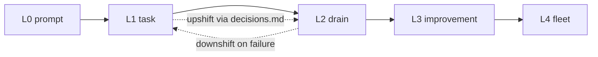

# Loops — stacking the factory

**Read with:** `reference/dark-factory.md` (Level 4 bar), `reference/factory-orchestration.md` (the loop body), `reference/execution-plan.md` (STOP + done criteria). Repo specifics: `.omakaseagent/factory.md`.

A **loop** is the factory run repeatedly without a human prompting each iteration. The human approves a **standing charter** once, then reviews gate evidence in batch. Level 4 holds: the human leaves the **iteration**, not the system.

---

## What this is (and is not)

| It **is** | It **is not** |
|-----------|----------------|
| A named ladder so "go up/down a loop" is actionable | A new autonomy level — checkpoint discipline holds |
| **Loop charters** humans approve once (`.omakaseagent/loops/`) | Permission to merge, ship, or deploy unattended |
| A **runner contract** any harness can drive (bash, CI cron, cloud agent) | An orchestration engine, scheduler, or DOT runner (v1) |
| One gate per iteration — evidence compounds | "Ran great overnight" with no artifacts |

---

## Loop ladder

| Level | Name | One iteration is | Human role |
|-------|------|------------------|------------|
| **L0** | Prompt loop | One human message → one agent reply | In every iteration |
| **L1** | Task loop | Factory loop on one task: brief → scenarios → work → evidence → gate | Approves brief; accepts gate |
| **L2** | Drain loop | One L1 run on the next eligible queue item (usually `.omakaseagent/backlog/`) | Approves charter once; reviews gates in batch |
| **L3** | Improvement loop | Audit → plans → drain (L2) → reconcile (`reference/backlog-audit.md`) | Approves charter; selects findings; reviews per cycle |
| **L4** | Fleet loop | L3 per repo across many repos | Named horizon only — not specified in v1 |



L1 is `reference/factory-orchestration.md` unchanged. L2 and L3 are L1 stacked under a charter — no new machinery, just standing intent plus a queue.

---

## Gearbox — when to shift

**Downshift (reliability).** Mandatory, immediate:

| Trigger | Shift |
|---------|-------|
| Gate rejected at batch review | That task class drops to L1 until its next accepted gate |
| Same STOP condition fires twice | Drop to L1; fix the plan or scenario before resuming |
| Drift check fails | Halt the loop; plans are stale — re-audit |
| Item exceeds charter risk ceiling or touches Class 3+ | Skip and flag; that item is handled interactively (L0/L1) |
| Two consecutive failed iterations | Halt the loop and report |

**Upshift (leverage).** Proposal-only: after **5 consecutive accepted gates** in a task class with zero critic P0/P1 findings, the agent may propose promoting that class one level up — as a `decisions.md` entry the human approves. Autonomy is earned and recorded, never assumed.

**Loop law (the Salty Lesson as house rule):** every manual human intervention mid-loop must leave behind a scenario, mechanical check, or memory entry that makes the next intervention unnecessary. An intervention that leaves nothing behind is a bug in the loop, not just in the code.

---

## Loop charter — standing intent

**Storage:** `.omakaseagent/loops/<slug>.md` — one file per standing loop. The charter is to a loop what a scenario is to a task: approved once, then binding. `omakase learn` scaffolds `loops/backlog-drain.md` as the default.

```markdown
# Loop: <slug>

## Intent
What this loop drains or improves, in one paragraph. Approved by <who> on <date>.

## Scope
- **Queue:** `.omakaseagent/backlog/` in dependency order (or another mechanical source)
- **In-scope paths:** ...
- **Risk class ceiling:** 2 — items above it are skipped and flagged, never attempted

## Iteration
One eligible item per run via `reference/factory-orchestration.md`: brief from the
plan, mechanical checks, critic, gate, queue status update, ledger row.

## Stop
- Queue empty
- A STOP condition in an execution plan fires
- A gate is rejected at review
- Two consecutive failed iterations
- Iteration cap: 5

## Checkpoint policy
- Gates reviewed in batch — no synchronous confirm per iteration
- Halt for human immediately when: risk ceiling would be exceeded, drift check
  fails, or work needs a scenario the charter does not cover

## Ledger
| # | Date | Item | Gate | Result |
|---|------|------|------|--------|
```

Ledger **Result** is one of: `DONE`, `FAILED`, `SKIPPED (reason)`, `HALT (stop condition)`, `EMPTY` (queue drained). The ledger is append-only and is the mechanical surface runners check between iterations.

---

## One iteration — agent contract

Each iteration is a **fresh agent run**:

1. Read the charter, `factory.md`, `taste.md`, `decisions.md`. Check Stop conditions **before** picking work — if any hold, append a `HALT`/`EMPTY` ledger row and exit.
2. Pick exactly **one** eligible queue item (status TODO, dependencies DONE, within risk ceiling).
3. Run the factory loop (`reference/factory-orchestration.md`). Scenarios must already exist or be covered by the charter — needing a new scenario mid-loop is a halt-for-human, not a question.
4. Write the gate file, update queue status, append the ledger row.
5. Exit. One item per iteration — no "while I'm here."

Where the interactive factory would ask the user, a loop **stops and records why**. No synchronous confirm mid-iteration, no scope improvisation, no merge/deploy.

---

## Runner contract — bring your own loop

Omakase provides the loop body and the brakes; the runner is yours. Any runner qualifies if it:

1. Starts each iteration as a **fresh agent run** with the fixed prompt below — no accumulated chat context.
2. Checks halt state **mechanically** between iterations (last ledger row `HALT`/`EMPTY`, or no new gate file produced).
3. Enforces the iteration cap even if the agent does not.
4. Never merges, deploys, or auto-accepts gates — batch review stays human.

**Fixed iteration prompt:**

```text
Read .omakaseagent/loops/backlog-drain.md and .omakaseagent/factory.md.
Execute exactly one iteration per reference/loops.md. Honor Stop conditions.
Write the gate file, append the ledger row, then stop.
```

**Example runners** (same contract, any harness):

```bash
# bash + any headless agent CLI (opencode shown; claude/cursor-agent equivalent)
PROMPT='Read .omakaseagent/loops/backlog-drain.md and .omakaseagent/factory.md. Execute exactly one iteration per reference/loops.md. Honor Stop conditions. Write the gate file, append the ledger row, then stop.'
for i in 1 2 3 4 5; do
  opencode run --agent omakase-engineer "$PROMPT" || break
  tail -1 .omakaseagent/loops/backlog-drain.md | grep -qE 'HALT|EMPTY' && break
done
```

- **CI cron:** schedule the same single-iteration prompt; one iteration per workflow run; the branch/PR carries the gate for batch review.
- **Cloud agents:** paste the fixed prompt; one iteration per agent run; review gates when you return.

---

## Relationship to other artifacts

| Artifact | Approves | Lifetime |
|----------|----------|----------|
| Scenario (`scenarios/`) | Product behavior | Until behavior changes |
| Execution plan (`backlog/`) | One task's steps + STOP rules | One task |
| **Loop charter (`loops/`)** | **Standing intent for repeated runs** | **Until revoked or Stop** |
| Gate (`gates/`) | Nothing — it proves | One iteration |
| `decisions.md` | Durable policy, including upshifts | Until revisited |

Rationale and the article this answers: `docs/LOOPS-REVIEW.md` in the omakaseagent repo.
