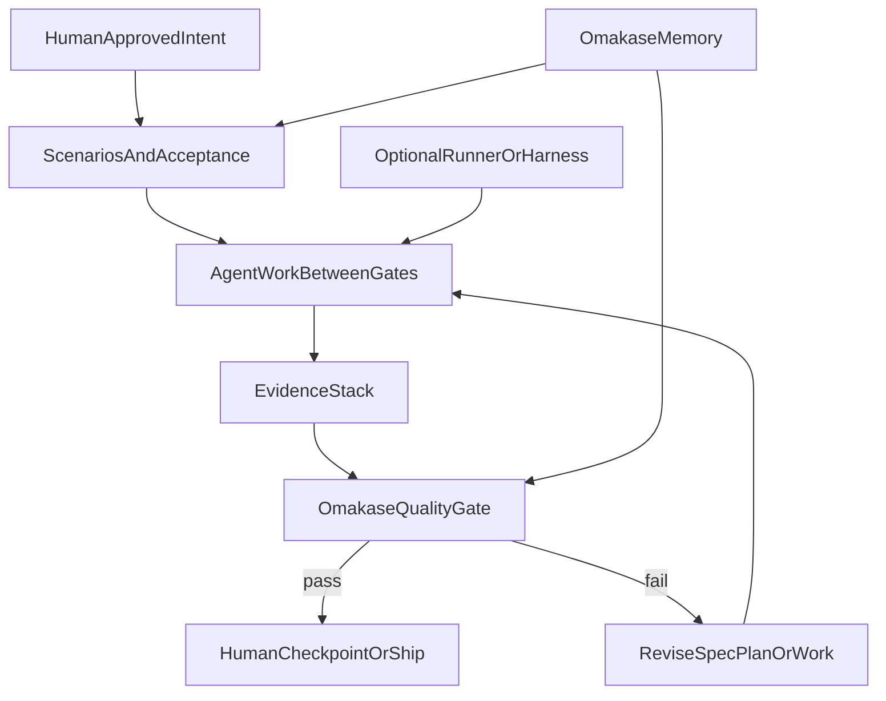

# Omakase dark factory methodology playbook

**Status (2026-06-04):** Active methodology reference. Shipped repo foundation (native agents, CI, AGENTS.md, three-team MLP) is archived in [`plans/archive/2026-06-04-shipped-foundation.md`](archive/2026-06-04-shipped-foundation.md). **Open backlog** here: scenario/gate/handoff templates, dogfooding, mechanical checks, evals — not a runner or Level 5 autonomy.

## Short version

Omakase should not try to become a dark factory runner first. That is the wrong center of gravity for this repo.

The better move is to make Omakase the practical standard small AI-native teams use to decide when agents are allowed to work longer without humans reading every diff. That means Omakase owns taste, quality gates, memory discipline, scenario review, and evidence. It can work with Cursor, Claude Code, Codex, Superpowers, dotpowers, Attractor, Kilroy, or a homegrown runner later. The runner is replaceable. The standard is the durable part.

The first target should be Level 4 autonomy in Dan Shapiro's framing. Humans approve intent, specs, scenarios, and checkpoints. Agents do the work between those gates. We do not start with full Level 5 dark factory operation where code merges and deploys with no human approval. That can come later for narrow, low-risk task classes only after the evidence model earns it.

The thesis:

> Omakase enables taste-led autonomy. Agents get more room to work only when senior taste, anti-slop critique, scenario evidence, and project memory are explicit enough to check.

This is more useful than "more automation." It gives teams a way to increase autonomy without making their codebase slowly worse.

## Who this is for

The first audience is a small AI-native product team.

That team probably already uses Cursor, Claude Code, Codex, or a similar tool. They may already be getting agents to write a lot of code. Their pain is not "how do we get the model to type faster?" Their pain is trust:

- How do we know the agent understood the repo?
- How do we know the work matches the spec?
- How do we know the agent did not add slop?
- How do we know the next run will remember what this run learned?
- How do we stop reviewing every line without fooling ourselves?

Omakase is well positioned here because it already treats craft, memory, critique, and handoff as first-class concerns. The repo is a markdown-first standard, not a runtime engine, and that is a strength for this stage.

## Where Omakase is today

The current repo already contains most of the language needed for this methodology.

[`README.md`](../README.md) defines Omakase as "one skill, senior taste, zero AI slop." It says critique is mandatory, project taste memory is first-class, and non-trivial output must explain its taste.

[`skill/SKILL.md`](../skill/SKILL.md) is already a router and standard. It defines:

- the 12 Omakase Rules
- the critique rubric
- project memory in `.omakaseagent/taste.md` and `.omakaseagent/decisions.md`
- Engineering, Critics, and Archives teams
- smart default routing
- visible "Memory consulted" and "Why this approach" expectations
- smart-default parity as a future enforcement target

Native sub-agents and the three-team MLP are shipped — see [`docs/NATIVE-SUBAGENTS.md`](../docs/NATIVE-SUBAGENTS.md) and [`plans/archive/2026-06-04-shipped-foundation.md`](archive/2026-06-04-shipped-foundation.md).

A May 2026 heavy-test battery was the most important internal evidence. It showed real gaps (still open unless noted):

- smart default behavior can lag explicit persona activation
- first-task memory seeding can be weak
- internal critique gates can be invisible
- critique output can become bloated
- parity and quality are not yet mechanically enforced

[`.omakaseagent/decisions.md`](../.omakaseagent/decisions.md) already records the key open question: whether markdown personas plus handoff protocols are enough for true cross-harness subagent orchestration. For this playbook, the answer is "enough to define the standard, not enough to run the factory."

That distinction matters. Omakase can become the methodology before it becomes infrastructure.

## What the dark factory sources actually say

The sources all point in the same direction, even when they use different language.

### MindStudio: the dark factory loop

MindStudio defines a dark factory codebase as one where agents plan, write code, run tests, and ship without human review or approval. The concrete loop is:

1. a structured trigger enters the system
2. a planner breaks it down
3. generator agents write and run code
4. an evaluator checks the output
5. the code ships

The useful warning is that tests, monitoring, rollback, and permission boundaries are not optional. If the evaluator cannot check the thing that matters, bad work passes. MindStudio also stresses progressive autonomy. Low-risk maintenance work comes before feature work, and production write access comes much later.

For Omakase, this argues against jumping straight to a runner or unattended merge flow. The first useful work is defining what the evaluator should care about.

Source: [What Is a Dark Factory Codebase?](https://www.mindstudio.ai/blog/what-is-a-dark-factory-codebase)

### Dan Shapiro: the five levels

Dan Shapiro's five levels are the cleanest way to place Omakase.

- Level 2 is pair programming with AI.
- Level 3 is agents producing lots of code while humans review diffs.
- Level 4 is humans writing specs, reviewing plans, and checking back after agents work for long stretches.
- Level 5 is the dark factory, where specs turn into software and humans do not write or read the code.

Omakase should aim first at Level 4. The user approves the work definition and checkpoints, not every line. That matches the interview direction and fits this repo's current maturity.

Source: [The Five Levels](https://www.danshapiro.com/blog/2026/01/the-five-levels-from-spicy-autocomplete-to-the-software-factory/)

### Dan Shapiro and StrongDM: stop reading the code

The more unsettling StrongDM lesson is: if the AI writes the code and humans still review every pull request, humans remain the bottleneck. The job changes. Humans build the validation system, feedback loops, scenarios, and tools that prove the work.

StrongDM's "Why am I doing this?" question should become an Omakase operating rule:

> If a human is inspecting something repeatedly, ask what rule, scenario, or evidence would let the system check it instead.

That does not mean humans disappear. It means humans spend their review energy on specs, scenarios, and evidence instead of routine diffs.

Source: [You Don't Write the Code](https://www.danshapiro.com/blog/2026/02/you-dont-write-the-code/)

### Simon Willison: scenarios and digital twins

Simon Willison's write-up of StrongDM gets to the hardest problem: if agents write both the implementation and the tests, how do you know they did not write weak tests?

StrongDM's answer is scenario testing. Scenarios are holdout user stories, often outside the codebase, used to judge behavior. For systems with external dependencies, they built a Digital Twin Universe: behavioral clones of third-party services like Okta, Jira, Slack, Google Docs, and Sheets. The clones are not perfect reimplementations. They reproduce enough externally observable behavior for agents and tests to exercise real flows cheaply and safely.

For Omakase, the direct translation is:

- review scenarios before work starts
- keep important scenarios separate from the agent's implementation path when possible
- judge externally visible behavior, not only internal structure
- reserve code review for failed evidence or high-risk areas

Source: [How StrongDM's AI team build serious software without even looking at the code](https://simonwillison.net/2026/Feb/7/software-factory/)

### StrongDM principles: seed, validation, feedback

StrongDM's principles compress the factory into one loop:

> Seed -> validation harness -> feedback loop. Tokens are the fuel.

The important part is the validation harness. The seed can be a spec, a screenshot, a bug report, or an existing repo. The loop only becomes trustworthy when the system can validate output close to the real environment and feed failures back into the next attempt.

Omakase already has the seed side through goals, specs, plans, taste memory, and decisions. It needs a clearer validation and feedback story.

Source: [StrongDM principles](https://factory.strongdm.ai/principles)

### StrongDM techniques: filesystem, shift work, summaries

Several StrongDM techniques map cleanly to Omakase:

- **Digital Twin Universe.** Use realistic behavioral clones or fixtures for important dependencies.
- **Gene Transfusion.** Point agents at concrete exemplars and ask them to move working patterns into a new context.
- **The Filesystem.** Use directories and files as memory. Omakase already does this with `.omakaseagent/`.
- **Shift Work.** Separate interactive work from fully specified work. Once the intent is complete, agents can run end-to-end between human gates.
- **Semport.** Port behavior across languages or frameworks while preserving meaning.
- **Pyramid Summaries.** Keep context at multiple detail levels so agents can zoom in when needed.

The most immediate Omakase fit is Shift Work. A team should turn vague requests into complete enough specs, scenarios, and gate criteria, then let the agent work between gates.

Source: [StrongDM techniques](https://factory.strongdm.ai/techniques)

### Attractor, Kilroy, and DOT graphs

StrongDM's Attractor describes a graph-structured non-interactive coding agent. Nodes are phases of work. Edges control routing. Runs can checkpoint, resume, branch, retry, and converge.

The open `strongdm/attractor` repo is especially interesting because it is mostly natural-language specs. The code is less important than the spec that causes multiple implementations to converge.

Kilroy shows one concrete version of this pattern:

- ingest English requirements into a Graphviz DOT pipeline
- validate the graph
- run stages in isolated git worktrees
- checkpoint each node
- store run history in CXDB
- resume interrupted runs

2389's "The Dark Factory Is a .dot file" makes a sharper claim: the durable artifact is often the pipeline graph, not the runner implementation. `dotpowers` then encodes the Superpowers process as one large DOT graph with human gates, TDD loops, multi-model review, cross-critique, loop caps, and shipping choices.

For Omakase, DOT is the wrong first deliverable but the right mental model. The playbook should think in graph nodes and gates, but Omakase should stay runner-agnostic for now.

Sources:

- [Attractor product page](https://factory.strongdm.ai/products/attractor)
- [strongdm/attractor](https://github.com/strongdm/attractor)
- [danshapiro/kilroy](https://github.com/danshapiro/kilroy)
- [The Dark Factory Is a .dot file](https://2389.ai/posts/the-dark-factory-is-a-dot-file/)
- [dotpowers](https://2389.ai/products/dotpowers/)
- [2389-research/dotpowers](https://github.com/2389-research/dotpowers)
- [jhugman/attractor-pi-dev](https://github.com/jhugman/attractor-pi-dev)

### Superpowers and dotpowers

Superpowers is a process methodology for coding agents. It starts with brainstorming, writes a design, writes a detailed plan, uses TDD, dispatches subagents, reviews work, and finishes a branch.

Omakase should not try to out-Superpowers Superpowers. The cleaner positioning is:

> Superpowers supplies a process. Omakase supplies the taste standard and quality gate.

That means Omakase can complement Superpowers, dotpowers, Cursor agents, Claude Code subagents, Codex, or any other runner. It should ask: did the work preserve taste, respect memory, pass scenarios, avoid slop, and produce evidence good enough for its risk?

Source: [obra/superpowers](https://github.com/obra/superpowers)

### Low-signal source notes

Some GitHub pages exposed only metadata through the fetch tool:

- [`jhugman/attractor-pi-dev`](https://github.com/jhugman/attractor-pi-dev) metadata was sparse, but the raw README provided useful implementation details.
- [`danshapiro/kilroy`](https://github.com/danshapiro/kilroy) metadata was sparse, but the raw README described the local-first runner model.
- [`2389-research/dotpowers`](https://github.com/2389-research/dotpowers) metadata was sparse, but the raw README and product page described the pipeline.
- [HackerNoon dark factory article](https://hackernoon.com/the-dark-factory-pattern-moving-from-ai-assisted-to-fully-autonomous-coding) fetched poorly and mostly returned page chrome. I would not lean on it as a primary source without a cleaner extraction.

## The Omakase dark factory contract

Omakase should own the parts of autonomy that determine whether the work is worth trusting.

Omakase owns:

- the taste standard
- anti-slop critique
- memory and decision discipline
- scenario quality
- handoff quality
- evidence requirements
- risk classification
- checkpoint review shape
- "why this approach" reasoning
- archive updates after significant work

Omakase should not own at first:

- deployment
- unattended merging
- production rollback
- provider orchestration
- a custom LLM client
- a custom runner
- a DOT execution engine
- a replacement for CI

That boundary keeps the project honest. It also matches the current repo. Omakase is markdown-first and portable. The first dark-factory move should make that standard usable by teams, not bury it inside a runner.

## The methodology

The playbook has one core loop:



### Step 1. Seed the work

The seed is the intent the team approves before agents go deep.

It can be:

- a product spec
- a bug report
- a design brief
- an issue
- a screenshot
- a failing test
- a current repo state plus a goal

The seed must include:

- what should change
- why it matters
- what should not change
- the user-visible behavior expected
- the risk class
- the evidence required before humans accept it

Omakase should reject vague seeds. "Make onboarding better" is not ready for Level 4 agent work. "Shorten the first-run path from account creation to first project, preserving existing SSO behavior, and prove it with scenarios A, B, and C" is closer.

### Step 2. Review scenarios before work starts

The team reviews scenarios and acceptance criteria before the agent writes code. This is the main human review point.

A good scenario says:

- who is acting
- what state the system starts in
- what action happens
- what the user or external system should observe
- what must not happen
- what evidence proves it

Scenarios are readable behavior contracts. Tests may implement them later, but the scenario is the thing the team approves.

For higher-risk systems, scenarios should include negative cases:

- permission denied
- stale data
- retry behavior
- dependency failure
- race or duplicate submission
- rollback or recovery path

This is the place to use StrongDM's holdout idea. If a scenario is meant to judge the work, do not hand all of its exact validation logic to the implementation agent too early. Let the agent know the behavior, but keep some acceptance checks independent where practical.

### Step 3. Let agents work between gates

Once intent and scenarios are approved, the agent can execute for a stretch.

For Level 4 Omakase, the human should not sit there reading every file as it changes. The agent should:

- consult `.omakaseagent/taste.md` and `.omakaseagent/decisions.md`
- choose the right persona or team
- write or update tests where appropriate
- run build, test, lint, typecheck, or package validation
- produce a checkpoint summary
- run an Omakase critique pass
- update memory when a durable decision or taste rule emerges

The agent should stop early if:

- the seed is ambiguous
- scenarios conflict
- required tooling is missing
- tests cannot be made meaningful
- the task touches a higher risk class than expected
- the evidence stack cannot be produced

That is not failure. That is the quality gate doing its job.

### Step 4. Collect the evidence stack

Omakase should treat acceptance as an evidence stack, not one green check.

The evidence stack has four layers.

**Scenario evidence.** The approved scenarios pass, or the agent explains exactly which scenario failed and why. For UI or integration work, this may include screenshots, logs, traces, browser runs, or simulated dependency behavior.

**Mechanical evidence.** The repo's normal checks pass. This includes tests, build, lint, typecheck, package install, generated bundle validation, or whatever the repo defines as its baseline.

**Critic evidence.** The Omakase Critic, Verification Critic, Structural Critic, or Deslop Critic reviews the output against the relevant rubric. The review names real risks, not generic praise.

**Memory evidence.** The work cites relevant taste and decisions. If it creates a new durable choice, it updates memory. If it violates prior memory, it says why.

The stack should scale with risk. A docs-only change does not need the same proof as an auth migration.

### Step 5. Human checkpoint

At the checkpoint, the human reviews:

- the original seed
- the scenarios
- the evidence stack
- the Omakase critique
- the summary of changed behavior
- the memory updates
- any explicit risks or unresolved questions

The human should not default to reading the whole diff. The point is to move review attention to intent and evidence.

The human can choose:

- accept
- ask for rework
- add scenarios
- downgrade or upgrade the risk class
- request code review because the evidence is weak or the area is sensitive
- stop and redesign

That is Level 4. Humans are still in charge, but not by acting as a line-by-line compiler.

## The risk ladder

The methodology needs a risk ladder because "agent autonomy" is not one thing.

### Class 0: documentation and packaging

Examples:

- README edits
- command help text
- markdown reference docs
- generated bundle validation
- dead link checks
- install smoke tests

Required gates:

- build or package check if applicable
- Omakase Deslop pass
- memory citation if the work changes project direction
- short checkpoint summary

Human review:

- review the rendered doc or summary
- spot-check diff only if the text changes policy or installation behavior

This is the safest place to start.

### Class 1: tests, examples, and low-risk maintenance

Examples:

- adding tests for existing behavior
- small refactors with no behavior change
- dependency bumps with lockfile and tests
- examples or sample projects
- formatting and lint cleanup

Required gates:

- baseline before and after
- relevant test run
- behavior-preservation statement
- Structural or Verification Critic pass when refactoring
- memory update if a new project convention appears

Human review:

- review evidence and checkpoint summary
- inspect diff if behavior preservation is not obvious

### Class 2: scoped product or workflow features

Examples:

- small user-facing feature with clear acceptance criteria
- CLI command addition
- new skill command
- focused agent persona change
- internal tool improvement

Required gates:

- approved spec and scenarios
- tests or scenario runs
- build and package validation
- Omakase Critic pass
- memory consistency check
- checkpoint summary with tradeoffs

Human review:

- approve spec and scenarios up front
- review evidence at checkpoint
- read code only for surprising changes or weak proof

This is the main Level 4 target.

### Class 3: high-risk app behavior

Examples:

- auth
- billing
- permissions
- data migration
- security behavior
- destructive operations
- production integration behavior

Required gates:

- approved spec
- positive and negative scenarios
- rollback or mitigation plan
- independent Verification Critic pass
- scenario evidence that does not rely only on agent-written unit tests
- human checkpoint before merge

Human review:

- review evidence first
- code review remains normal until the team has enough history to loosen it

Omakase can still help here, but it should not pretend this is ready for low-friction autonomy.

### Class 4: production operations and irreversible actions

Examples:

- deploys
- data deletion
- schema changes against production
- secrets and access controls
- external customer-impacting operations

Required gates:

- human approval
- production-specific runbook
- rollback proof
- monitoring or alert check
- explicit permission boundary

Human review:

- humans stay directly involved

This class is out of scope for the first Omakase dark-factory playbook. It should be named so teams do not accidentally promote it.

## The quality gates

Omakase's first adoption wedge should be quality gates. The repo already has the raw material. The playbook turns it into repeatable team behavior.

### Gate 1. Context loaded

The agent must read the relevant repo context and `.omakaseagent/` memory before significant work.

Failure signs:

- ignores existing architecture
- repeats a decision already made
- creates generic code that does not match the repo
- cannot name which memory entries shaped the work

### Gate 2. Spec and scenario clarity

The work must have a seed clear enough for Level 4 execution.

Failure signs:

- no explicit non-goals
- no acceptance criteria
- no user-visible behavior
- no risk class
- no scenario evidence planned

### Gate 3. Anti-slop critique

The output must pass Omakase's taste standard.

Failure signs:

- vague explanations
- bloated abstractions
- defensive code without a real invariant
- comments that narrate obvious code
- "future flexibility" with no current need
- copied boilerplate that ignores local patterns

### Gate 4. Verification

Claims must be backed by fresh evidence.

Failure signs:

- "should work" language
- tests described but not run
- no baseline for behavior-preserving refactors
- no reproduction for bug fixes
- no artifact for scenario satisfaction

### Gate 5. Memory update

Durable lessons must go into `.omakaseagent/`.

Failure signs:

- same problem repeats across runs
- decisions live only in chat
- taste rules are not updated after critique
- handoffs lose the "why"

### Gate 6. Checkpoint review

The human should get a checkpoint that lets them decide without spelunking.

A good checkpoint includes:

- what changed
- what scenarios passed
- what mechanical checks ran
- what the critic found
- what memory changed
- what risks remain
- what decision the human needs to make

## Suggested repo-local artifacts

The methodology can stay markdown-first at first. Do not start with a full engine.

For a repo adopting Omakase, add:

```text
.omakaseagent/
  taste.md
  decisions.md
  scenarios/
    README.md
    <feature-or-flow>.md
  gates/
    README.md
    <date>-<task>-gate.md
  handoffs/
    <date>-<task>-handoff.md
```

The exact shape can evolve, but the responsibilities should be clear.

`taste.md` records what good looks like and what the team rejects.

`decisions.md` records durable choices and why they were made.

`scenarios/` stores human-readable acceptance scenarios. These are the team's reviewed behavior contracts.

`gates/` stores evidence stacks and Omakase critique results.

`handoffs/` stores concise continuation notes for humans or future agents.

This is enough to teach the workflow before adding automation.

## Operating cadence for a small team

### Daily

- Pick tasks by risk class.
- For Class 2 or higher, approve scenarios before agent work starts.
- Let agents work between gates.
- Review evidence stacks, not full diffs by default.
- Add memory updates for durable lessons.

### Weekly

- Review repeated critic findings.
- Promote common review comments into taste rules or gate checks.
- Retire stale taste rules.
- Identify one human review habit that can become a scenario, check, or template.

### Per milestone

- Audit which task classes earned more autonomy.
- Check whether agents are repeating old mistakes.
- Add or remove gates based on real failures.
- Decide whether any Class 0 or Class 1 work can move toward Level 4.5 autonomy.

## How this applies to Omakase itself

Omakase can dogfood the playbook without building a runner.

Good first uses in this repo:

- Class 0: README, command help, installation docs, bundle validation docs
- Class 1: build script tests, install smoke tests, dist guard checks
- Class 2: new skill commands, persona changes, scenario eval definitions

Open gaps this playbook should still address:

- No executable scenario harness for explicit versus smart-default parity.
- No durable gate report format under `.omakaseagent/`.
- No automated check that non-trivial outputs include memory citation or internal critique markers.
- No install smoke tests beyond build + native-agent verify (optional Class 1 expansion).

Closed since playbook draft (see archive): CI via `.github/workflows/verify.yml`; repo `AGENTS.md`.

The first implementation later should probably not be "build Attractor for Omakase." It should be:

- define scenario templates
- define gate report templates
- add a small validation script or CI check where the rule is mechanical
- use Omakase Critics to review outputs until some of that review can become executable

## Why not DOT first

DOT pipelines are compelling. Attractor, Kilroy, and dotpowers show that graph-shaped workflows are a good fit for agentic software development.

But DOT should stay inspiration-only for Omakase right now.

Reasons:

- The user chose methodology playbook over runner blueprint.
- Omakase's current value is portable taste and critique, not execution.
- A DOT graph would force premature decisions about runners, model routing, checkpoint storage, and human gate UX.
- Small teams can adopt markdown gates and scenarios faster than they can adopt a full pipeline engine.
- The repo has known quality and eval gaps that should be solved before orchestration gets more powerful.

The right way to use DOT now is as a mental model. Omakase workflows have nodes, gates, loops, and exits. Later, if the playbook proves useful, those nodes can be encoded in DOT or another runner format.

## Relationship to Superpowers

Superpowers already defines a strong agentic development process:

- brainstorm
- design
- plan
- use worktrees
- TDD
- subagent-driven implementation
- review
- finish the branch

Omakase should complement that. The simplest positioning:

> Superpowers tells the agent how to move through the work. Omakase tells the agent what quality bar the work must clear.

That lets teams use both without confusion.

Superpowers can run the process. Omakase can judge:

- whether the design has taste
- whether the plan avoids slop
- whether the implementation preserved local patterns
- whether the evidence stack is good enough
- whether the archive captured the durable lesson

dotpowers is especially useful as proof that a methodology can become a pipeline later. Omakase does not need to start there.

## Progressive adoption path

### Phase 0. Name the contract

Document what Omakase owns in autonomous work:

- taste
- memory
- critique
- scenario discipline
- evidence requirements
- checkpoint shape
- risk classification

Document what it does not own yet:

- deployment
- unattended merge
- production operations
- a custom runner

### Phase 1. Write the playbook artifacts

Add template docs for:

- scenario specs
- gate reports
- checkpoint summaries
- handoffs
- memory updates
- risk classification

Keep them markdown-first.

### Phase 2. Dogfood on Omakase itself

Use the methodology on this repo for Class 0 through Class 2 work.

Start with:

- docs and README changes
- skill and persona changes
- install smoke tests
- build script behavior
- explicit versus smart-default eval scenarios

The goal is to prove the playbook changes behavior before automating it.

### Phase 3. Add mechanical checks

Only automate checks that are crisp.

Good candidates:

- `npm run build`
- dist bundle guard
- required file presence
- scenario file schema
- gate report required headings
- memory citation marker in gate reports
- no direct edits to `dist/` without source rebuild

Bad candidates:

- "is this tasteful?"
- "is this senior?"
- "does this feel like slop?"

Those still need Omakase Critics until enough examples exist to make narrower checks.

### Phase 4. Add scenario evals

Build a small eval set from real Omakase failures:

- first-task memory seeding
- explicit versus smart-default parity
- visible internal critique pass
- domain detection and merge behavior
- non-engineering deactivation
- critique output bloat

Each eval should define:

- seed prompt
- expected artifacts
- forbidden failures
- required evidence
- critic rubric

This is where the repo starts to look like a software factory, but only around the Omakase behavior itself.

### Phase 5. Decide on orchestration later

Once the playbook and evals work manually, revisit runners.

Options:

- keep it harness-native with Cursor or Claude Code subagents
- add simple repo-local scripts
- encode workflows as DOT
- experiment with Attractor-compatible runners
- use a Kilroy-style worktree and checkpoint model

The decision should come from pain. If manual gates and scenario evals become repetitive, automate them. If they do not, stay simple.

## What would make this fail

The methodology fails if it becomes another pile of impressive words that nobody runs.

Specific failure modes:

- Omakase talks about critique but does not require evidence.
- Humans still review every diff out of habit, so Level 4 never arrives.
- Scenarios are vague, so agents optimize for plausible output.
- Memory becomes a junk drawer.
- Critic reports become long and ceremonial.
- The team adopts a runner before it knows what its gates should check.
- Low-risk and high-risk work use the same autonomy rules.
- The repo's own behavior is not dogfooded.

The cure is boring and concrete: write the scenario, run the check, produce the gate report, update memory, then decide.

## The first version of the playbook should say

A small team using Omakase should start with this rule:

> Humans approve what should be true. Agents prove it became true.

That means the human owns:

- intent
- constraints
- scenarios
- risk class
- final acceptance

The agent owns:

- implementation
- local context gathering
- test and build execution
- evidence collection
- critique pass
- memory updates
- checkpoint summary

Omakase owns:

- the taste bar
- the anti-slop standard
- the review shape
- the memory contract
- the gate language

That is the useful path toward a dark factory. Not lights out on day one. Lights dimmed in the right rooms, with sensors that actually work.

## Appendix: source coverage checklist

Covered in this memo:

- [MindStudio dark factory overview](https://www.mindstudio.ai/blog/what-is-a-dark-factory-codebase)
- [HackerNoon dark factory pattern](https://hackernoon.com/the-dark-factory-pattern-moving-from-ai-assisted-to-fully-autonomous-coding), marked low-signal because fetched content was mostly page chrome
- [Dan Shapiro, Five Levels](https://www.danshapiro.com/blog/2026/01/the-five-levels-from-spicy-autocomplete-to-the-software-factory/)
- [Dan Shapiro, You Don't Write the Code](https://www.danshapiro.com/blog/2026/02/you-dont-write-the-code/)
- [Simon Willison on StrongDM](https://simonwillison.net/2026/Feb/7/software-factory/)
- [2389, The Dark Factory Is a .dot file](https://2389.ai/posts/the-dark-factory-is-a-dot-file/)
- [2389 dotpowers product page](https://2389.ai/products/dotpowers/)
- [StrongDM principles](https://factory.strongdm.ai/principles)
- [StrongDM techniques](https://factory.strongdm.ai/techniques)
- [StrongDM Attractor](https://factory.strongdm.ai/products/attractor)
- [jhugman/attractor-pi-dev](https://github.com/jhugman/attractor-pi-dev)
- [strongdm/attractor](https://github.com/strongdm/attractor)
- [danshapiro/kilroy](https://github.com/danshapiro/kilroy)
- [2389-research/dotpowers](https://github.com/2389-research/dotpowers)
- [obra/superpowers](https://github.com/obra/superpowers)

Repo artifacts grounded in the memo:

- [`README.md`](../README.md)
- [`skill/SKILL.md`](../skill/SKILL.md)
- [`.omakaseagent/decisions.md`](../.omakaseagent/decisions.md)
- [`docs/NATIVE-SUBAGENTS.md`](../docs/NATIVE-SUBAGENTS.md) (native sub-agents; harness research, implementation plans, and heavy-test report archived)

